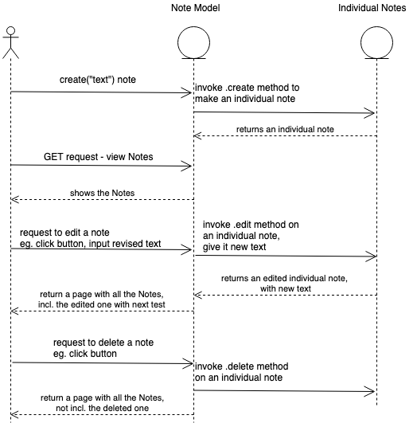

# Notes app - Updates as at Wed 4 Sept 2019

## Purpose
* Build a notes app as a frontend, single page web app using pure JavaScript.

## Sequence Diagram (initial version, to be updated)


## Progress to date:
- Build testing framework
- Create model for a single note
- Create model for a list of notes (with a method to add a new note to it)
- Create note list view, which takes data from the model and converts it to a string with HTML tags
- Create index.html page, create controller that takes data from the view and inserts it into an element on the HTML page


## To do
- Step 7 Spec to be done next - TDD a single note view
- After that - currently the app has no user interface, so this needs to be built
- After that - see below list of User Stories for final end product 

### User Stories - For full project

```
As a programmer
I can see a list of my notes, where each note is abbreviated to the first 20 characters
So I can find the one I want
```

```
As a programmer
I can create a new note
So I can record something I need to remember
```

```
As a programmer
I can see the full text of an individual note on its own page
So I can see all the information in the note
```

(NB: notes do not need to be permanently stored.  If the user refreshes their web page, they'll lose their notes, and that's fine.)
